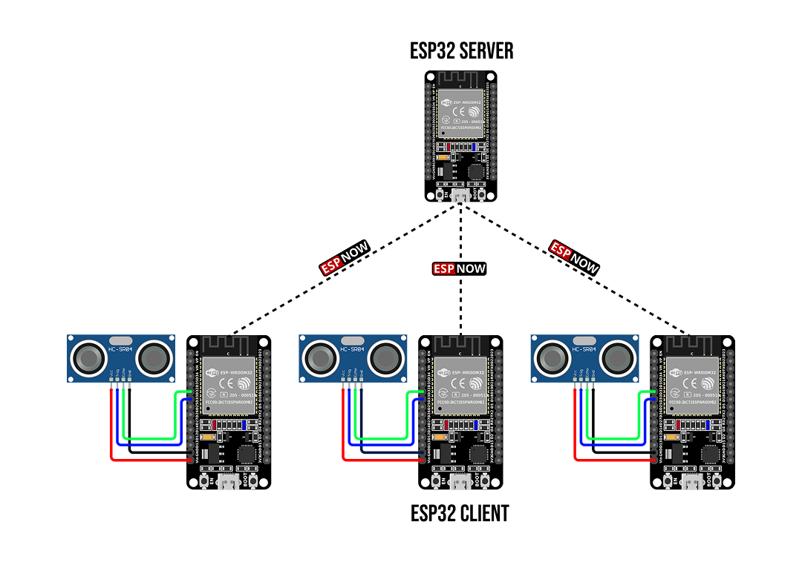
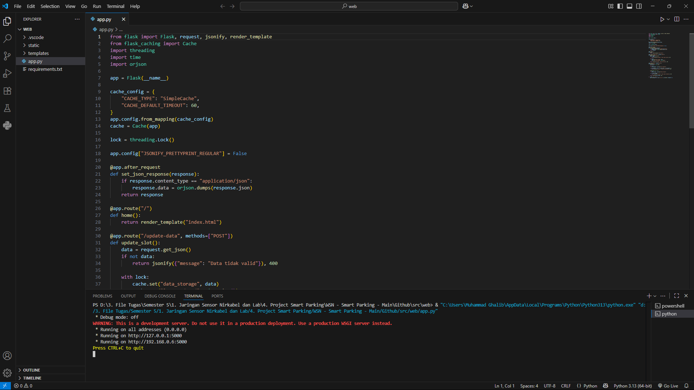
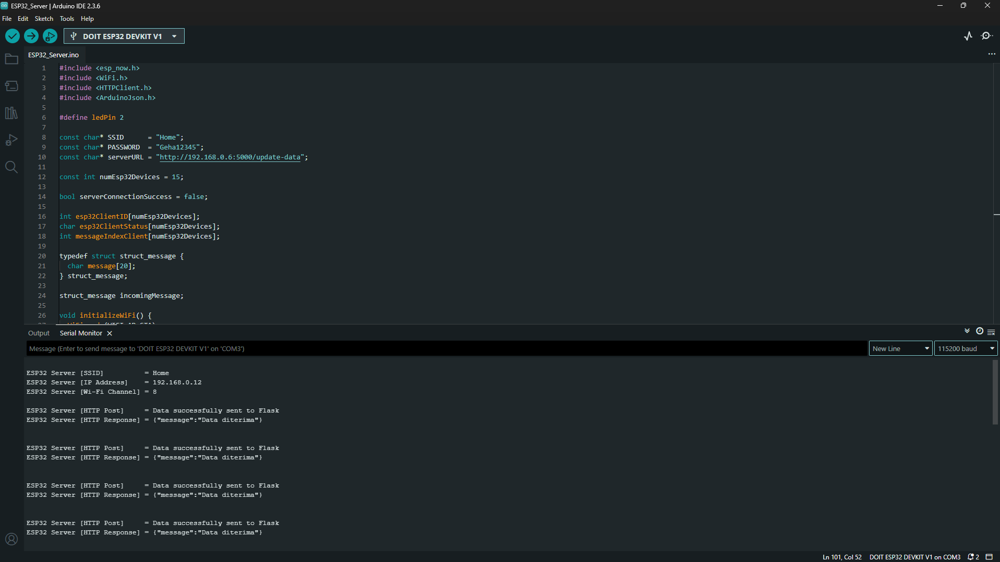
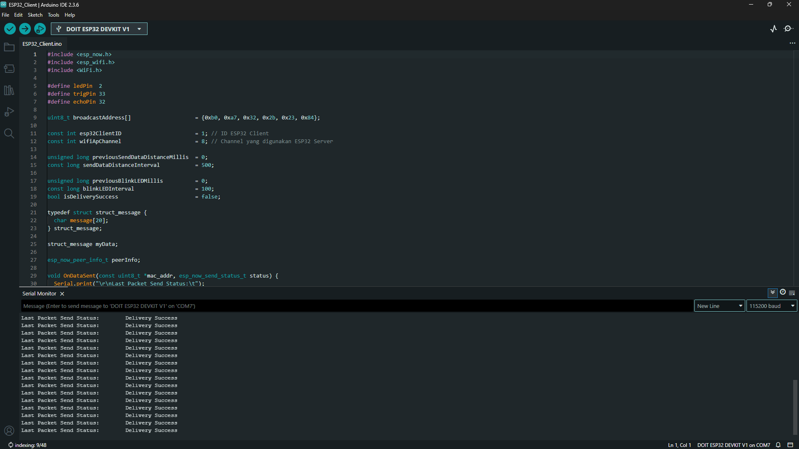
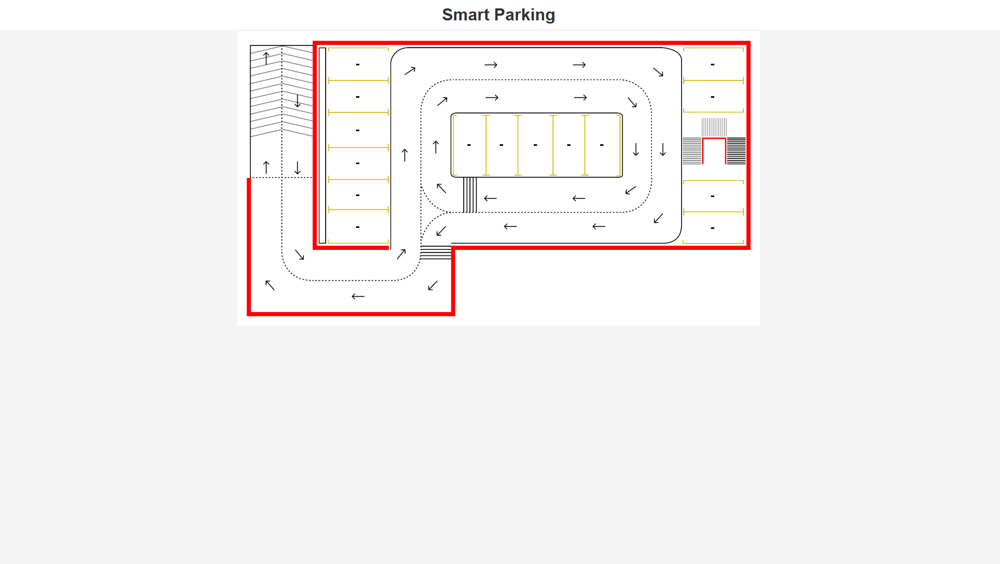
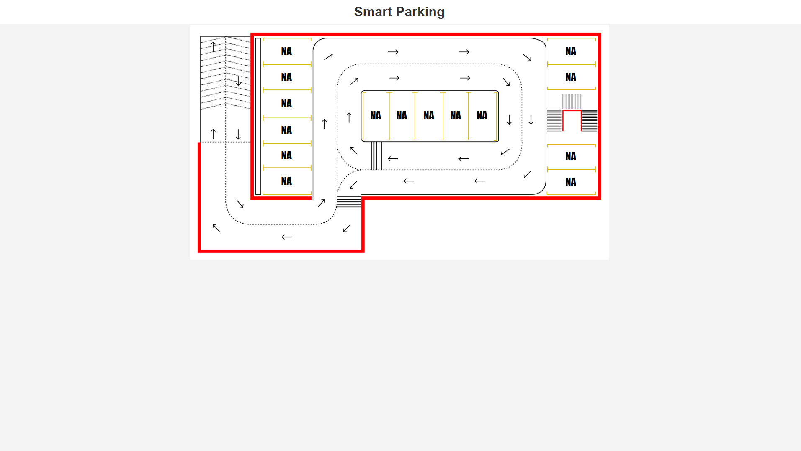
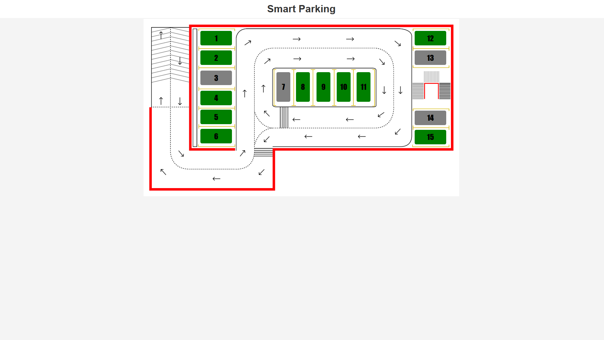
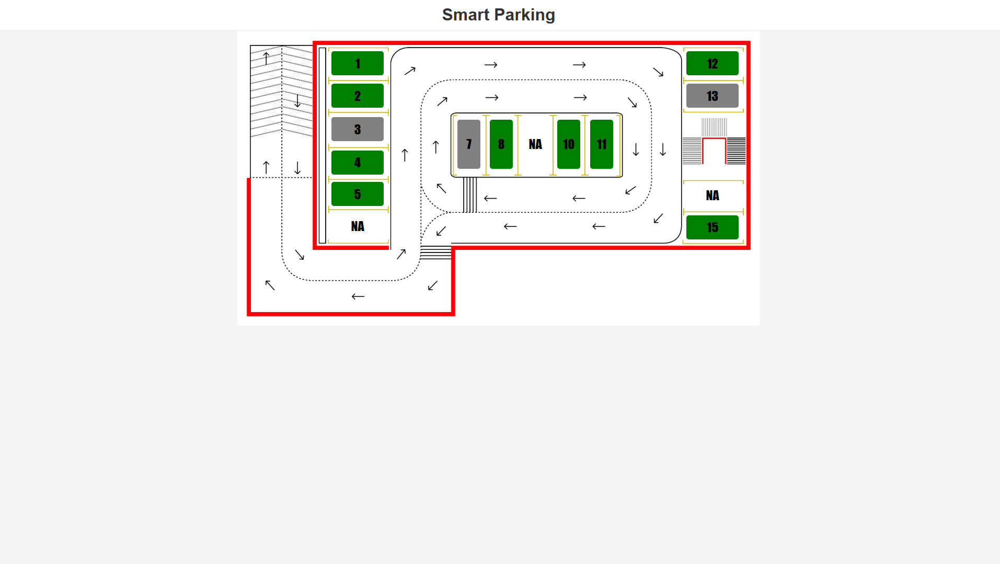

# 🚗 Website Smart Parking Berbasis IoT Menggunakan Framework Flask

## Deskripsi proyek
Proyek Website Smart Parking ini adalah sistem parkir cerdas berbasis IoT yang menggunakan ESP32 sebagai client dan server untuk memantau ketersediaan lahan parkir secara real-time. Setiap slot parkir dilengkapi dengan sensor yang dihubungkan ke ESP32 client, yang kemudian mengirimkan status parkir ke ESP32 server melalui protokol ESP-NOW.

Data tersebut diteruskan ke aplikasi web berbasis Flask yang menampilkan dashboard visual denah parkir. Pengguna dapat melihat slot yang kosong atau terisi melalui website secara langsung, sehingga memudahkan proses parkir dan meningkatkan efisiensi lahan parkir.

## 🔌 Hardware yang Digunakan
- 16x ESP32 Devkit V1
- 15x HC-SR04 Ultrasonic Sensor
  
## 💻 Software yang Digunakan
- Arduino IDE
- Visual Studio Code
- Web Browser

## 🧩 Teknologi yang digunakan
- HTML
- CSS
- Java Script
- Python Flask

## 📘 Skematik Rangkaian


## ⚙️ Konfigurasi Pin
|   HC-SR04  | ESP32 Client |
|:----------:|:------------:|
|    VCC     |      Vin     |
|    GND     |      GND     |
|    Trig    |      33      |
|    Echo    |      32      |

## 🔧 Pembagian Komponen Sistem
Sistem Smart Parking ini terdiri dari beberapa komponen utama, baik pada sisi perangkat IoT maupun aplikasi web. Setiap komponen memiliki peran masing-masing agar sistem dapat berjalan secara real-time dan terintegrasi.

### 🌐 Front-end (HTML, CSS, JS)

- Menampilkan denah parkiran secara real-time kepada pengguna.
- Mendapatkan data status parkir dari API yang disediakan backend.
- Memvisualisasikan status slot parkir berdasarkan data dari backend.

### ⚙️ Back-end (Flask)

- Menerima dan memproses data status parkir dari ESP32 Server.
- Menyediakan API untuk frontend yang berisi informasi parkir.

### 🖧 ESP32 Server

- Berfungsi sebagai pusat pengumpulan data dari seluruh ESP32 Client menggunakan protokol ESP-NOW.
- Menyimpan dan meneruskan informasi status slot parkir ke backend.

### 📈 ESP32 Client

- Membaca data sensor ultrasonik pada setiap slot parkir untuk mendeteksi ketersediaan.
- Mengirimkan status slot parkir ke ESP32 Server melalui protokol ESP-NOW.


## 🚀 Memulai Proyek

### 1. Clone Repository

```bash
git clone https://github.com/muhammadghalib/Website-Smart-Parking-Berbasis-IoT-Menggunakan-Framework-Flask.git
```

### 2. Menjalankan Flask

1. Pastikan Python telah terinstal dan periksa versi dengan menjalankan di terminal:
    ```
    python --version
    ```
2. Buka Visual Studio Code dan buka folder `src → web`.
3. Pastikan ekstensi Python telah terinstal di Visual Studio Code.
4. Pilih interpreter Python yang sesuai dengan menekan `Ctrl+Shift+P`, ketik `Python: Select Interpreter`, lalu pilih interpreter Python yang sudah terinstal di sistem Anda.
5. Buka file `app.py` di Visual Studio Code.
6. Install semua dependencies yang dibutuhkan dengan perintah:
    ```
    pip install -r requirements.txt
    ```
7. Jalankan aplikasi Flask dengan perintah berikut di terminal:
    ```
    python app.py
    ```
8. Tampilan terminal Flask
   
   Flask berhasil dijalankan dengan alamat `http://192.168.0.6:5000` dan siap untuk menerima data dari ESP32 Server.

### 3. Menjalankan ESP32 Server

1. Install board ESP32 yang didukung yaitu versi :
    ```
    2.0.8
    ```
2. Masuk ke folder `src → arduino → libraries` salin semua folder yang ada didalamnya lalu paste ke dalam folder libraries Arduino di perangkat Anda.
3. Masuk ke folder `src → arduino → server` buka file berikut ini :
    ```
    Get_Mac_Address.ino
    ```
4. Sambungkan ESP32 ke komputer dan unggah sketch ke perangkat.
5. Pada serial monitor anda akan mendapatkan alamat MAC, contoh :
    ```
    [DEFAULT] ESP32 Board MAC Address: 00:1A:2B:3C:4D:5E
    ```
    Simpan alamat MAC diatas dan akan digunakan pada tahap selanjutnya.
6. Masuk ke folder `src → arduino → server` buka file berikut ini :
    ```
    ESP32_Server.ino
    ```
7. Sesuaikan konfigurasi berikut pada baris kode:
    - Baris ke-8: Masukkan SSID dari WiFi anda, contoh :
      ```c++
      const char* SSID = "myWiFi";
      ```
    - Baris ke-9: Masukkan Password dari WiFi anda, contoh :
      ```c++
      const char* PASSWORD = "123456789";
      ```
    - Baris ke-10: Masukkan alamat Flask dan Endpoint Post, contoh :
      ```c++
      const char* serverURL = "http://192.168.0.6:5000/update-data";
      ```
8. Setelah semua konfigurasi selesai, sambungkan ESP32 ke komputer dan unggah sketch ke perangkat.
9. Tampilan serial monitor
    
    ESP32 Server sudah siap menerima data dari ESP32 Client dan menggunakan Wi-Fi channel `8`. Simpan angka tersebut dan akan digunakan pada tahap selanjutnya.


### 4. Menjalankan ESP32 Client

1. Hubungkan ESP32 dengan sensor HC-SR04 sesuai dengan konfigurasi pin.
2. Masuk ke folder `src → arduino → client` buka file berikut ini :
    ```
    ESP32_Client.ino
    ```
3. Sesuaikan konfigurasi berikut pada baris kode:
    - Baris ke-8: Masukkan MAC address dari ESP32 Server, contoh :
      ```c++
      uint8_t broadcastAddress[] = {0x00, 0x1A, 0x2B, 0x3C, 0x4D, 0x5E};
      ```
    - Baris ke-9: Masukkan ID ESP32 Client, ini akan merepresentasikan slot parkir ke-1, contoh :
      ```c++
      const int esp32ClientID = 1;
      ```
      Pada proyek ini memiliki 15 slot parkir maka membutuhkan 15 ESP32. setiap ESP32 Client menggunakan sketch yang sama, hanya ID-nya yang berbeda sesuai nomor slot parkir.
    - Baris ke-10: Masukkan Wi-Fi channel yang digunakan ESP32 Server, contoh :
      ```c++
      const int wifiApChannel = 8;
      ```
4. Setelah semua konfigurasi selesai, sambungkan ESP32 ke komputer dan unggah sketch ke perangkat.
5. Tampilan serial monitor
   
   ESP32 Client berhasil mengirimkan informasi ketersediaan slot parkir ke ESP32 Server.


### 5. Tampilan Website

Website menampilkan antarmuka berbeda tergantung status ESP32 Server dan Client, dengan rincian sebagai berikut:

1. Website saat ESP32 Server mati
   
   Ketika ESP32 server dalam keadaan mati, semua nomor slot parkir pada website akan ditampilkan dengan tanda “-”.
3. Website saat ESP32 Server aktif
   
   Ketika ESP32 server aktif, semua nomor slot parkir pada website akan ditampilkan dengan status “NA”.
5. Website saat semua ESP32 Client hidup
   
   Jika seluruh ESP32 client aktif, maka website akan menampilkan setiap slot parkir dengan warna hijau atau abu-abu sesuai dengan pembacaan sensor, lengkap dengan nomor slot parkirnya.
7. Website saat beberapa ESP32 Client mati
   
   Jika sebagian ESP32 client tidak aktif, maka slot yang terkait pada website akan ditampilkan dengan status “NA”.

## 📝 Catatan Penting
1. Pada ESP32 Server, konfigurasi `WiFi.mode()` harus menggunakan mode *Access Point* dan *Station* sekaligus `(WIFI_AP_STA)`. Meskipun tidak ada perangkat yang terkoneksi melalui Wi-Fi, pengaturan ini tetap dibutuhkan agar ESP32 dapat menjalankan fungsi Wi-Fi dan ESP-NOW secara bersamaan. Implementasi pengaturan ini ditempatkan pada baris ke-27 sebagai berikut:
   ```c++
   WiFi.mode(WIFI_AP_STA);
   ```
   Referensi :
   - [ESP-NOW Web Server Sensor Dashboard (ESP-NOW + Wi-Fi)](https://randomnerdtutorials.com/esp32-esp-now-wi-fi-web-server/)
   - [esp-now-network-and-wifi-gateway](https://github.com/m1cr0lab-esp32/esp-now-network-and-wifi-gateway/)

## 💡 STAY CURIOUS
